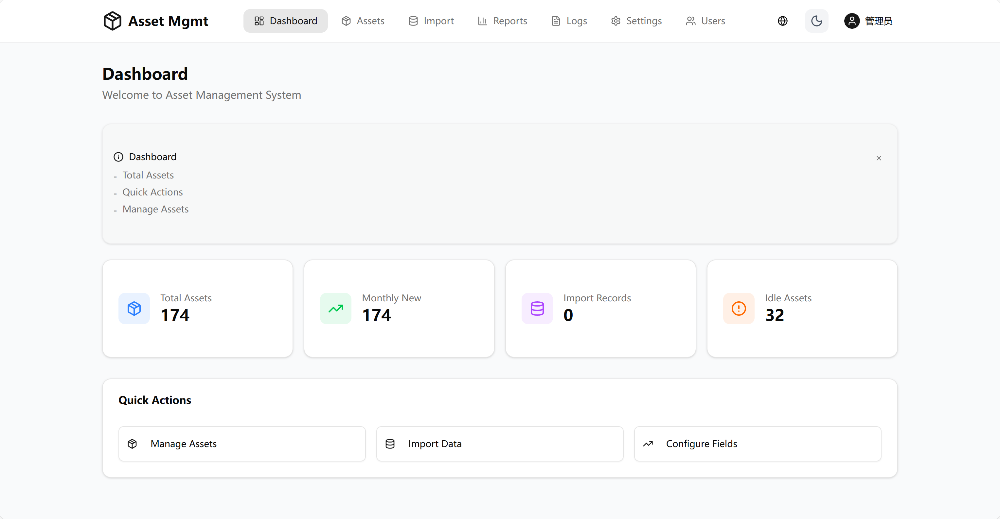

# 资产管理系统

[](https://github.com/zweien/asset-anagement-system/releases/tag/v1.1.0)
[](https://opensource.org/licenses/MIT)
[](https://www.typescriptlang.org/)
[](https://reactjs.org/)
[](https://nodejs.org/)

一个现代化的全栈资产管理系统，支持动态字段配置、Excel 导入导出、AI 智能助手和全面的报表功能。

**🎉 版本 1.1.0 发布！** - 新增 AI 智能助手，支持自然语言查询资产数据。

[English](./README.md) | [文档](./docs/) | [API 文档](./docs/API.md) | [更新日志](./docs/CHANGELOG.md)

## 📸 截图



## ✨ 功能特性

- 🤖 **AI 智能助手** - 通过自然语言查询和分析资产数据
- 📊 **动态字段配置** - 无需修改数据库结构即可创建自定义字段
- 📥 **Excel 导入导出** - 支持字段映射的批量 Excel 导入
- 🗄️ **数据库迁移** - 从外部数据库导入数据（MySQL、PostgreSQL、SQLite）
- 📈 **可视化报表** - 可自定义报表模板的图表和统计功能
- 🔍 **SQL 查询** - 管理员可直接执行安全的 SQL 查询
- 🌐 **国际化** - 完整的中英文翻译支持
- 🌓 **深色模式** - 内置主题切换，支持系统偏好检测
- 🔐 **基于角色的访问控制** - 管理员、录入员、普通用户三种角色
- 📝 **操作日志** - 完整的操作历史和变更追踪
- 💾 **备份与恢复** - 数据库备份和恢复功能
- 📱 **响应式设计** - 基于 shadcn/ui 的移动端友好界面

## 🤖 AI 智能助手

AI 助手支持自然语言交互，让数据查询更简单：

- **自然语言查询** - "显示所有在用状态的资产"
- **统计分析** - "帮我统计上个月新增的资产数量"
- **快捷问题** - 一键点击常用查询
- **流式响应** - 实时显示 AI 回复
- **安全可控** - 仅执行 SELECT 查询，支持限流

支持的 LLM 提供商：
- DeepSeek（推荐）
- OpenAI
- 硅基流动
- 其他 OpenAI 兼容的 API

## 🚀 快速开始

### 环境要求

- Node.js 18+
- npm 或 pnpm

### 安装步骤

```bash
# 克隆仓库
git clone https://github.com/zweien/asset-anagement-system.git
cd asset-management-system

# 安装依赖
npm install
cd client && npm install && cd ..
cd server && npm install && cd ..

# 初始化数据库
cd server
npm run db:push
cd ..

# 启动开发服务器
./init.sh start
```

或手动启动：

```bash
# 终端 1 - 后端
cd server && npm run dev

# 终端 2 - 前端
cd client && npm run dev
```

访问 http://localhost:5173 使用系统

### 配置 AI 助手（可选）

1. 登录管理员账户
2. 进入系统设置页面
3. 在"AI 模型配置"卡片中填写：
   - API Key
   - API 地址（如 https://api.deepseek.com）
   - 模型名称（如 deepseek-chat）

### 默认账户

- **用户名：** `admin`
- **密码：** `admin123`

> ⚠️ 首次登录后请修改默认密码！

## 📁 项目结构

```
.
├── client/                 # React 前端
│   ├── src/
│   │   ├── components/     # 可复用 UI 组件
│   │   │   └── ai/         # AI 助手组件
│   │   ├── pages/          # 页面级组件
│   │   ├── lib/            # 工具函数、API 客户端、类型定义
│   │   ├── stores/         # Zustand 状态管理
│   │   ├── hooks/          # 自定义 React Hooks
│   │   └── i18n/           # 国际化配置
│   └── package.json
├── server/                 # Express 后端
│   ├── src/
│   │   ├── controllers/    # 请求处理
│   │   ├── services/       # 业务逻辑
│   │   ├── routes/         # API 路由
│   │   ├── middleware/     # Express 中间件
│   │   ├── prompts/        # AI 提示词
│   │   └── utils/          # 工具函数
│   ├── prisma/
│   │   └── schema.prisma   # 数据库模型
│   └── package.json
├── docs/                   # 文档
├── e2e/                    # E2E 测试
└── uploads/                # 文件上传目录
```

## 🛠️ 技术栈

| 前端 | 后端 |
|------|------|
| React 19 | Express.js |
| TypeScript | TypeScript |
| Vite | Prisma ORM |
| TailwindCSS v4 | SQLite / PostgreSQL / MySQL |
| shadcn/ui | JWT 认证 |
| Zustand | Swagger/OpenAPI |
| React Router | Winston 日志 |
| Recharts | Zod 验证 |
| i18next | Vercel AI SDK |
| @ai-sdk/react | @ai-sdk/openai |

## 📖 文档

- [技术架构](./docs/ARCHITECTURE.md) - 系统架构和设计决策
- [API 文档](./docs/API.md) - REST API 接口文档
- [贡献指南](./docs/CONTRIBUTING.md) - 如何参与贡献
- [更新日志](./docs/CHANGELOG.md) - 版本历史

## 🧪 测试

```bash
# 后端单元测试
cd server && npm test

# E2E 测试
npm run test:e2e

# E2E 测试（带 UI）
npm run test:e2e:ui
```

## 🤝 参与贡献

欢迎参与贡献！请查看 [贡献指南](./docs/CONTRIBUTING.md) 了解详情。

1. Fork 本仓库
2. 创建功能分支 (`git checkout -b feature/amazing-feature`)
3. 提交更改 (`git commit -m 'feat: add amazing feature'`)
4. 推送到分支 (`git push origin feature/amazing-feature`)
5. 提交 Pull Request

## 📝 许可证

本项目基于 MIT 许可证开源 - 详见 [LICENSE](LICENSE) 文件。

## 🙏 致谢

- [shadcn/ui](https://ui.shadcn.com/) - 精美的 UI 组件库
- [Prisma](https://www.prisma.io/) - 下一代 ORM
- [Recharts](https://recharts.org/) - 可组合的图表库
- [Lucide Icons](https://lucide.dev/) - 美观的开源图标
- [Vercel AI SDK](https://sdk.vercel.ai/) - AI 应用开发工具包

---

由资产管理团队用 ❤️ 打造
