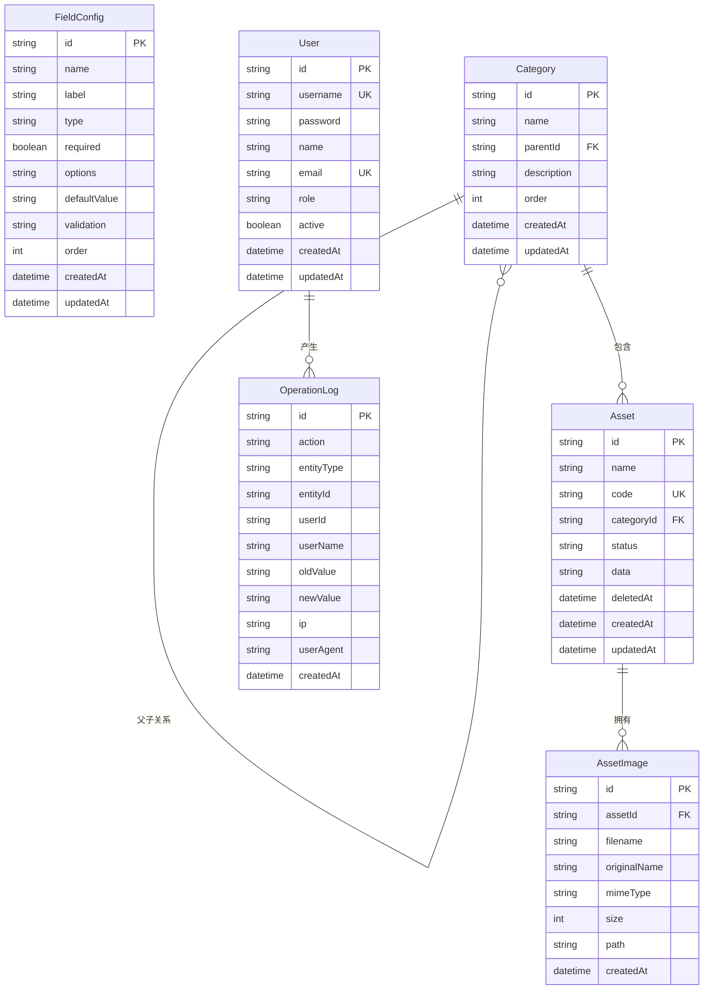

# 资产录入管理系统 - 架构图

## 1. 系统架构图


## 2. 数据库 ER 图



## 3. API 请求流程图


## 4. 前端组件结构图


## 5. 后端分层架构图

```mermaid
flowchart LR
    subgraph Routes["Routes 层"]
        R1[/fields]
        R2[/assets]
        R3[/categories]
        R4[/import]
        R5[/export]
    end

    subgraph Controllers["Controllers 层"]
        C1[FieldController]
        C2[AssetController]
        C3[CategoryController]
        C4[ImportController]
        C5[ExportController]
    end

    subgraph Services["Services 层"]
        S1[FieldService]
        S2[AssetService]
        S3[CategoryService]
        S4[ImportService]
        S5[ExportService]
    end

    subgraph Data["Data 层"]
        Prisma[Prisma Client]
    end

    R1 --> C1 --> S1
    R2 --> C2 --> S2
    R3 --> C3 --> S3
    R4 --> C4 --> S4
    R5 --> C5 --> S5

    S1 --> Prisma
    S2 --> Prisma
    S3 --> Prisma
    S4 --> Prisma
    S5 --> Prisma
```

## 6. 数据导入流程图


## 7. 资产生命周期状态图


## 8. 部署架构图


## 9. 功能模块关系图


---

*使用 Mermaid 语法渲染*
